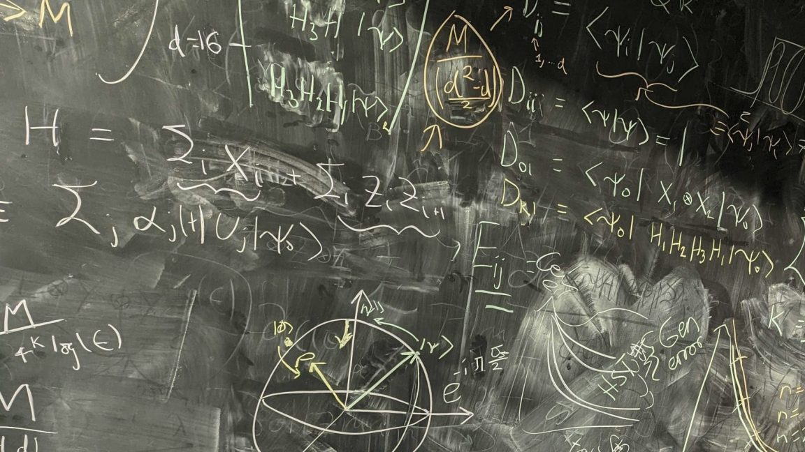
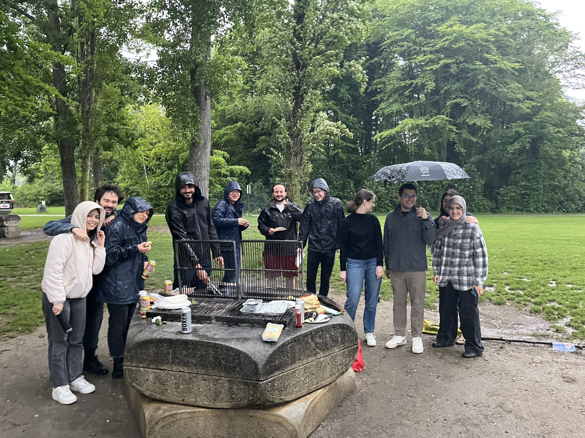
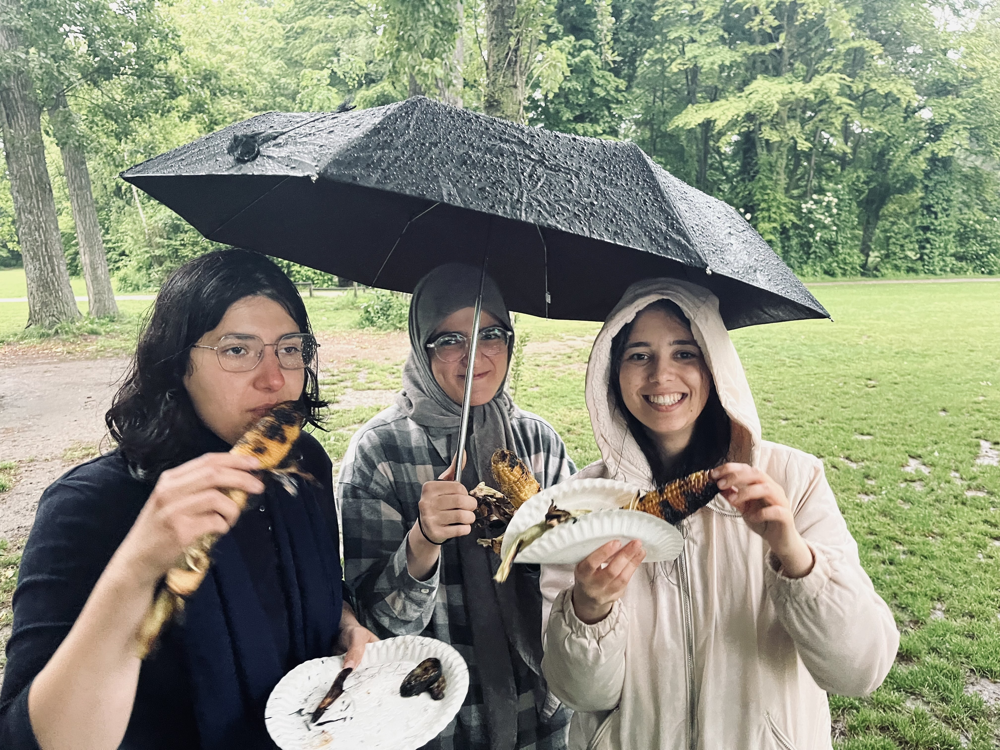
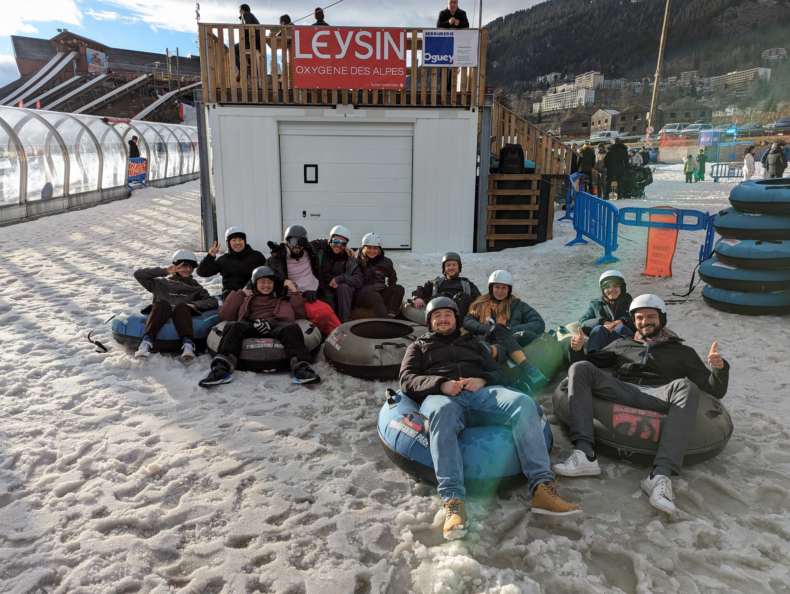
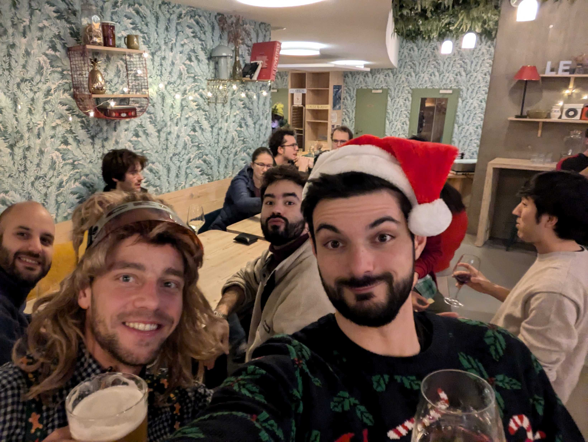
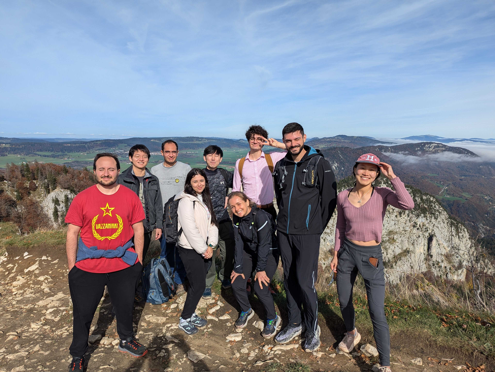
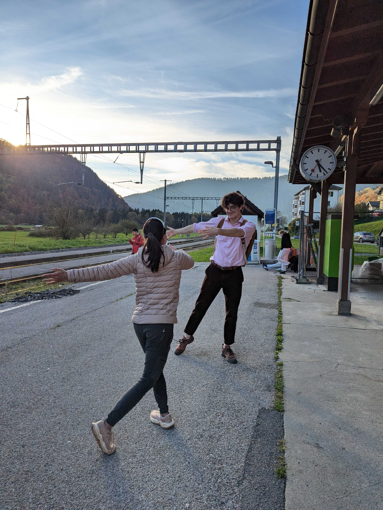

<figure>
  
  <figcaption>QIC Group collage 2023</figcaption>
</figure>

<figure>
  
  <figcaption>QIC Christmas Party December 2025</figcaption>
</figure>

<figure>
  
  <figcaption>A pretty blackboard</figcaption>
</figure>

<figure>
  
  
  
  <figcaption>QIC Group BBQ at the lake</figcaption>
</figure>

<figure>
  
  <figcaption>QIC Group snowtubing in Leysin</figcaption>
</figure>

<figure>
  
  <figcaption>Quantum theory Christmas party</figcaption>
</figure>

<figure>
  
  
  <figcaption>Group Hiking</figcaption>
</figure>